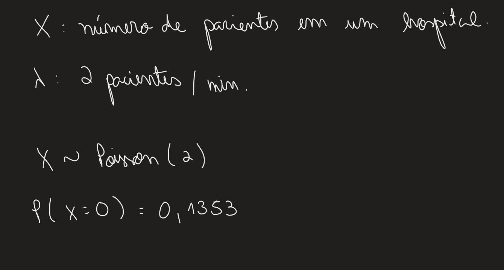
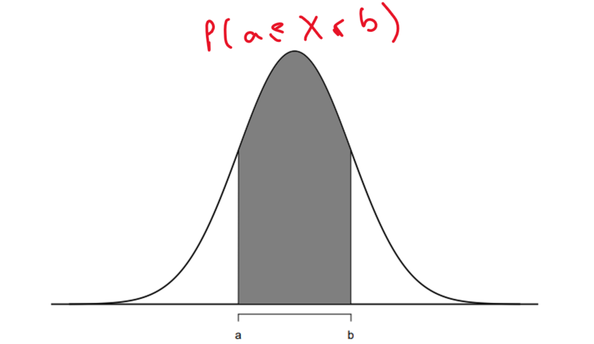
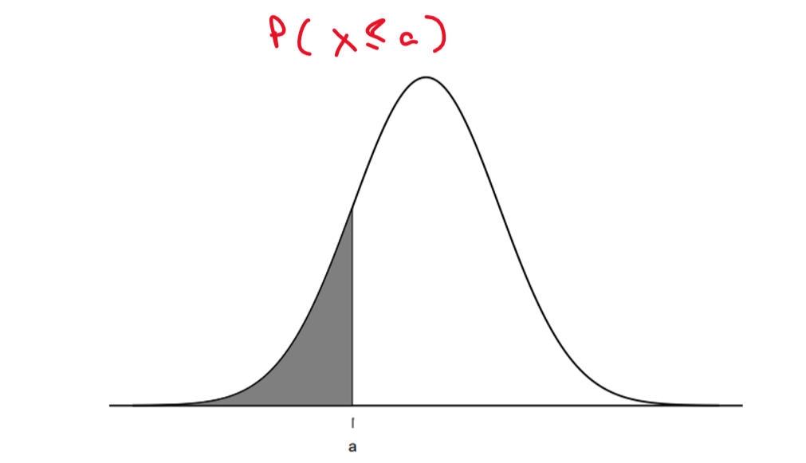
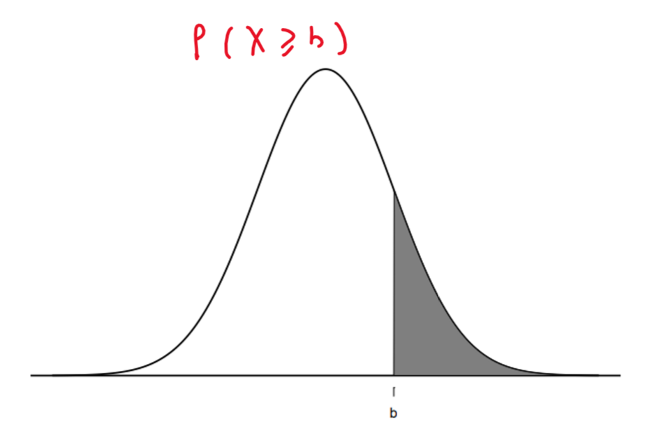
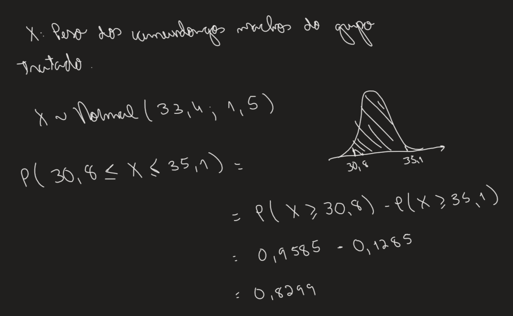

# Probabilidade

## Definições e fórmulas

Definindo um evento, conhecemos o espaço amostral possível. Podemos calcular a probabilidade a Priori com

    P(E) = n(E) / n(Ω)

### Probabilidade Condicional

Quando um evento **A** influencia a probabilidade de um evento **B** ocorrer.

    P(A|B) = P(A ∪ B) / P(B)

# Variável Aleatória

Associa um número real a cada evento do espaço amostral. Dado um exemplo de evento:

    X = Número de ocorrências da face coroa.
    n = 3

<div align="center">
    
</div>

Dessa maneira, relacionamos P(X = 0) com a probabilidade de cair nenhuma coroa em 3 lançamentos de moedas.

## Variável aleatória discreta

Assume números finitos e contáveis.

Exemplos:
- Número de Sprints até a finalização do produto MVP.

## Variável aleatória contínua

Assume valores infinitos de um intervalo.

Exemplos:
- Tempo decorrido para a conclusão de uma funcionalidade.

# Distribuição Binomial

Possui apenas 2 resultados: sucesso ou fracasso.

    X ~ Binomial(n, p)

Sendo **n** o número de tentativas, e **p** a probabilidade de sucesso ou fracasso, dependendo da **definição da variável aleatória X**.

### Exemplo:

Em uma estufa, o pesquisador verifica que existem plantas
doentes ou resistentes. Sabendo que a probabilidade da
planta ser resistente é igual a 0,75, determine:

1) A probabilidade que menos de duas plantas sejam
doentes, em uma amostra de 3 plantas.

<div align="center">
    
</div>

# Distribuição Poisson

Calcula a probabilidade de ocorrência de sucesso em um determinado intervalo

    X ~ Poisson(λ)

Sendo λ a média de ocorrência em determinado tempo. **Sempre devemos observar a grandeza dessa média**.

### Exemplo:

Em momentos de pico, um determinado hospital recebe, em média, 2 pacientes por minuto.

1) Qual a probabilidade de que, em um determinado intervalo de dois minutos do horário de pico, não tenha nenhum paciente para ser atendido?

<div align="center">
    
</div>

# Distribuição Normal

Distribuição utilizada para variável aleatória contínua. Ela define um gráfico com a **média sendo o ponto mais alto**. Se os dados estiverem com uma **média alta**, o gráfico se desloca para a **direita**. Mas, se a **média for baixa**, o gráfico se desloca para a **esquerda**. Da mesma forma, Se os dados estiverem muito **dispersos**, o gráfico se encontra com um aspecto de **achado e largo**. Se não, ele terá um aspecto de **alto e fino**, para **dados mais concentrados** em determinada região.

    X ~ Normal(μ, σ)

Sendo μ a média dos dados, e σ o desvio padrão. Lembrando que, **a variância é o desvio padrão ao quadrado**.

## Captura de dados em determinados intervalos

### Dados entre um intervalo **a** e **b**
<div align="center">
    
</div>

### Dados superiores à **a**
<div align="center">
    
</div>

### Dados inferiores à **a**
<div align="center">
    
</div>

### Exemplo:

Avaliaram o peso de camundongos, aos 4 meses de vida, de dois grupos: controle e tratados com injeção de PBS. Os camundongos machos do grupo tratado apresentaram peso médio igual a 33,4g, com desvio padrão de 1,50g. Já os camundongos machos do grupo contrle apresentaram peso médio de 32,8g e desvio padrão de 1,36g.

1) Qual é a porcentagem de camundongos machos do grupo tratado com peso entre 30,8g e 35,1g?

<div align="center">
    
</div>

## Quantis

Em uma situação no qual queremos encontrar um atributo que deixe alguma **porcentagem dos dados abaixo ou superior a ele**, utilizamos **quantil**.

Utilizando o exemplo anterior:

2) Qual peso dos camundongos machos do grupo tratado que deixa, aproximadamente, 2.5% dos camundongos abaixo dele?

Nesse caso, definimos α, que é a porcentagem, entre **0 < α < 1** no qual queremos analisar:

    α = 0.025 (2,5%)
    μ = permanece igual
    σ = permanece igual

# Teoria da estimação

Utilizada para encontrar valores ou intervalos de parâmetros desconhecidos da população, tal como, a média, a variância, e etc. 

## Estimadores

- Estimadores pontuais: fornecem um valor único definido

- Estimadores intervalares: fornecem uma faixa de valores, dado um nível de confiança.

**O nível de confiança é definido por um intervalo entre 1 - α. Sendo α, o nível de significância, complementar ao nível de confiança.**

### Exemplo 1:

Dado uma insdústria elétrica que fabrica lâmpadas. Em uma amostra de 16 lâmpadas, foi obtida média igual a 800 horas e variância igual a 1600 horas. Encontre o intervalo de 95% de confiança para a média.

Obs: **95% de confiança, sugere um nível de significância (α) de 5%.**

Comandos:
```
md = 800
dp = 40
n = 16
conf = 0.95
alfa = 1 - conf

margem_erro = qt((alfa/2), n - 1, lower.tail = FALSE) * (dp / sqrt(n));

IC = cbind(md - margem_erro, md + margem_erro)
```

INTERPRETAÇÃO: "Com 95% de confiança, a média de vida útil de uma lâmpada fabricada na indústria elétrica, está entre 778.6855 e 821.3145 horas."

### Exemplo 2:

A Secretaria de Saúde de um determinado município precisa verificar se a proporção de diabéticos entre os residentes no município é igual à proporção brasileira, que é de 0,089 diabéticos por habitante. Em uma amostra 600 pessoas, foram encontrados 63 diabéticos. Construa o intervalo de 95% de confiança para a proporção de diabéticos desse município. Interprete o intervalo encontrado.

Como não há desvio padrão, podemos utilizar esses comandos:

```
n = 600
np = 63     # número de sucessos em n
pe = np/n
conf = 0.95  
alfa = 1 - conf
margem_erro = qnorm(1 - alfa/2) * (sqrt(pe *(1 - pe))/sqrt(n))
IC = cbind(pe - margem_erro, pe + margem_erro)
```

INTERPRETAÇÃO: "Com 95% de confiança, a proporção de diabéticos residentes no município está entre 8.05% e 12.95%."

# Determinação do tamanho da amostra

É possível determinar o tamanho de uma população dado um tamanho de amostra piloto, um nível de significante e uma margem de erro estimado.

### Exemplo:

Um pesquisador deseja saber qual a área foliar de uma determinada espécie de algodoeiro com erro máximo de 10 cm e 90% de confiança. Em uma amostra piloto de tamanho 12, ele obteve devio padrão s = 40 cm. Qual é o tamanho de amostra mínimo que ele deve utilizar?

```
dp_amostrap = 40
n_amostrap = 12
conf = 0.9
alfa = 1 - conf
margem_erro_desejada = 10
tamanho_amostra = (qt((alfa/2),n_amostrap - 1, lower.tail = FALSE)* dp_amostrap/margem_erro_desejada)^2
```

R: n >= 51.6032. Portanto, o tamanho mínimo de amostra de 52 cm.

# Teoria da decisão

A teoria da decisão implica em verificações de hipóteses sobre a população.

## Hipôtese

Devemos construir uma hipôtese que auxiliará na conclusão de uma afirmativa.

## valor-p

O valor-p ajuda a decidir se as evidências encontradas em uma amostra são suficientemente fortes para rejeitar a hipótese nula.

- Se o valor-p for menor que o nível de significância (α), então rejeita-se h0.
- Se o valor-p for maior que o nível de significância, então aceita-se h0.

## Encontrando os valor-p:

### Teste Bilateral

```
p_valor = 2*pnorm(abs(zc), lower.tail = FALSE)
```

### Teste Unilateral a esquerda

```
p_valor_z=pnorm((zc), lower.tail = TRUE)
```

### Teste Unilateral a direita

```
p_valor = pnorm((zc), lower.tail = FALSE)
```

### Exemplo (sem desvio padrão):

Para verificar a proporção de falhas que uma determinada marca notebook apresenta, a empresa entrevistou  aleatoriamente 225 clientes que possuíam o aparelho há mais de seis meses,  obtendo que 198 não apresentaram falhas. Para satisfazer às normas internas é necessário que no máximo 8% dos aparelhos apresentem falhas. A um nível de 1% de significância qual será o resultado obtido pelo organismo de controle da empresa?

```
n = 225
ns = 198
p0 <- 0.92
pe = ns/n
zc = (pe - p0)/sqrt((pe*(1 - pe))/n)
```

1) Hipôtese:
Utilizaremos o teste unilateral à esquerda para verificar se a porcentagem de aparelhos que falham é menor do que 92% deles.

- h0: p >= 0.92
- h1: p < 0.92

2) Valores que justificam a decisão tomada.

```
p_valor = 0.03241908
```

3) Decisão:
Como o p-valor é maior do que o nível de significância, então aceita-se h0.

4) Conclusão:
Ao nível de significância de 1%, não há evidencias suficientes para concluir que a proporção de falhas seja menor do que 8%.

5) Resposta:
O organismo de controle da empresa, ao realizar o teste, concluirá que os notebooks não atendem às normas internas. Pois, não é possível afirmar que 92% dos aparelhos não apresentam falhas.

### Exemplo (com desvio padrão):

## Encontrando os valor-p:

### Teste Bilateral

```
p_valor = 2*pt(abs(tcalc),df=n-1, lower.tail = FALSE)
```

### Teste Unilateral a esquerda

```
p_valor = pt(tcalc,df=n-1, lower.tail =TRUE)
```

### Teste Unilateral a direita

```
p_valor = pt(tcalc,df=n-1, lower.tail = FALSE)
```

### Exemplo:

Um pesquisador avaliou a área foliar de uma espécie de algodoeiro. Tomando uma amostra de tamanho 28, ele obteve uma média de 70cm e um desvio padrão de 25cm para a área foliar. Verifique se a área foliar média dessa espécie de algodoeiro é igual a 80cm, com nível de significância α = 5%.

```
dp = 25
media = 70
n = 28
valor_testado = 80
tcalc = ((media - valor_testado)/(dp/ n^0.5))
```

TODO: fazer interpretação dos resultados.