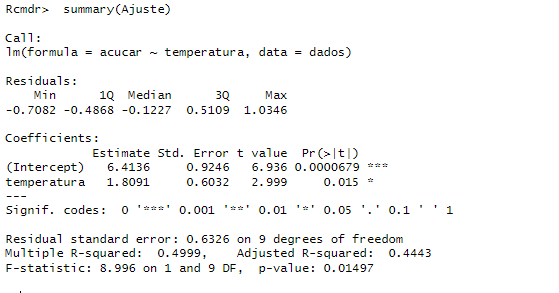

# Prova final

1. [Dados emparelhados](#emparelhados)
2. [Dados não emparelhados](#nao-emparelhados)
3. [Correlação linear](#correlação-linear)

## Informações extras:
- p-valor > α: aceita-se h0.
- p-valor < α: aceita-se h1.

## Emparelhados
Dados emparelhados são conjunto de dados em que cada **observação de um grupo está relacionada diretamente a uma observação do outro grupo**.

### Exemplo:


Rstudio:
```
dados <- data.frame(
    antes = c(270, 410, 350 ...),
    depois = c(175, 308, 248, ...)
)
```
Rcommander:
1. Statistics
2. Means
3. Paired t-Test


1. two-sided: u1 - u2 = 0
2. diference < 0: u1 - u2 < 0
3. diference > 0: u1 - u2 > 0

Resposta:
1. Definir u1 e u2
2. Montar a hipôtese
3. Decisão: Como o p-valor(__) é __ do que o α(_). Aceita-se h0/h1.
4. Conclusão: Com _% de confiança, (não) é possível afirmar que _.

## Nao emparelhados
Dados não emparelhados são conjuntos de dados que as observações de um grupo **são independentes das do outros**.

### Exemplo:


Devemos comparar a variabilidade de dois grupos quando se deseja realizar, posteriomente, um teste t para médias de dados não emparelhados. Criando uma necessidade de fazer a comparação das variabilidades para utilizar o teste correto: com **variâncias iguais** ou com **variâncias diferentes**.

Rstudio:
```
dados <- data.frame(
    produtividade = c(14.5, 15.8, 24 ...),
    tipo = c("A","A","A" ...)
)
```
## Variância
1. Pergunta: a variabilidade são iguais?

Rcommander:
1. Statistics
2. Variances
3. Two-variances F-test


1. Two-sided: σ1/σ2 = 1

** Obs: Sempre utilizar α = 0.05. **

Resposta:
1. Montar o teste de hipôtese
2. Decisão: Como o p-valor(__) é __ do que o α(_). Aceita-se h0/h1.
3. Conclusão: Com _% de confiança, (não) é possível afirmar que as variâncias são iguais.


## Média
2. Pergunta: A produtividade do Aipim Branco é maior do que a produtividade da Milagrosa?

Rcommander:
1. Statistics
2. Means
3. Independent Samples t-test


1. two-sided: u1 - u2 = 0
2. diference < 0: u1 - u2 < 0
3. diference > 0: u1 - u2 > 0

assume equal variances?
R: Se o teste de variância foi igual, coloca **yes**, se não, coloca **no**.

Resposta:
1. Definir u1 e u2
2. Montar o teste de hipôtese
3. Decisão: Como o p-valor(__) é __ do que o α(_). Aceita-se h0/h1.
4. Conclusão: Com _% de confiança, (não) é possível afirmar que _.

## Correlação linear

A correlação linear mede a força e direção da relação linear entre duas variáveis quantitativas. Ela indica até que ponto uma variável tende a aumentar quando a outra também aumenta ou diminui.

### Coeficiente de Correlação (r)

O coeficiente de correlação de Pearson, é a medida que tem como finalidade avaliar a correlação linear. Seus valores variam entre -1 e +1:

1. r = +1 : Correlação positiva perfeita. Isso significa, que, na medida que uma variável aumenta, a outra também aumenta de forma perfeitamente linear.

2. r = 0 : Não há correlação linear entre as variáveis.

3. r = -1 : Correlação negativa perfeita. Isso significa, que, na medida que uma variável aumenta, a outra diminui de forma perfeitamente linear.

### Exemplo

Um estudo foi realizado sobre a quantidade de açúcar convertido em um processo em várias temperaturas. Os dados foram codificados e registrados a seguir:


Rstudio:
```
dados <- data.frame(
    temperatura = c(1, 1.1, 1.2 ...),
    acucar = c(8.1, 7.8, 8.5 ...)
)
```

1) Gerar o gráfico de dispersão dos dados

Rcommander:
1. Graphs
2. XY conditioning plot


Figura 1: Gráfico de dispersão da quantidade de açucar convertido (g) em diferentes temperaturas (C).

### Regressão linear

2) Encontre a equação linear e interprete as estimativas calculadas.

Rcommander:
1. Statistics
2. Fit model
3. Linear regression

** 
    Obs: é importante verificar qual vai ser a variável dependente e independente.
    Na primeira coluna é a dependente, e a segunda é a independente.
**



Desse resultado, é possível retirar muita informação.


Interpretação:
- B0 = 6.41 : Com a temperatura de 0 C, o acuçar convertido seria de, aproximadamente, 6.41 g.
- B1 = 1.81 : A cada aumento de 1 C na temperatura, a massa de açucar convertido é aumentado em 1.81 g.

3) Verifique se a o intercepto e a inclinação são significativos, ao nível de 5% de significância.


Decisão: Como o p-valor < 0.0001, é menor do que α(0.05), devemos aceitar h1.

Conclusão: Com 5% de nível de significancia, podemos afirmar que o intercepto é significativo.


Decisão: Como o p-valor(0.015) é menor do que α(0.05), devemos aceitar h1.

Conclusão: Com 5% de nível de significancia, podemos afirmar que a inclinação é significativa.

3) Encontre o coeficiente de determinação e interprete-o.


R^2 = 0.4999. Aproximadamente 49.99% da variação de açucar convertido é explicada pelo modelo.

4) Encontre o coeficiente de correlação linear.


r = 0.7070

5) Com 5% de significancia, verifique se p = 0.


Decisão: Como o p-valor(0.0150) é menor do que α(0.05), devemos aceitar h1.

Conclusão: Com 5% de significancia, não podemos afirmar que p = 0.