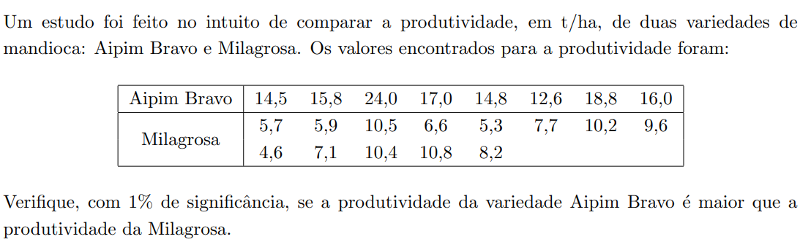

# Prova final

1. [Dados emparelhados](#emparelhados)
2. [Dados não emparelhados](#nao-emparelhados)

## Informações extras:
- p-valor > α: aceita-se h0.
- p-valor < α: aceita-se h1.

## Emparelhados
Dados emparelhados são conjunto de dados em que cada **observação de um grupo está relacionada diretamente a uma observação do outro grupo**.

### Exemplo:


Rstudio:
```
dados <- data.frame(
    antes = c(270, 410, 350 ...),
    depois = c(175, 308, 248, ...)
)
```
Rcommander:
1. Statistics
2. Means
3. Paired t-Test


1. two-sided: u1 - u2 = 0
2. diference < 0: u1 - u2 < 0
3. diference > 0: u1 - u2 > 0

Resposta:
1. Definir u1 e u2
2. Montar a hipôtese
3. Decisão: Como o p-valor(__) é __ do que o α(_). Aceita-se h0/h1.
4. Conclusão: Com _% de confiança, (não) é possível afirmar que _.

## Nao emparelhados
Dados não emparelhados são conjuntos de dados que as observações de um grupo **são independentes das do outros**.

### Exemplo:


Devemos comparar a variabilidade de dois grupos quando se deseja realizar, posteriomente, um teste t para médias de dados não emparelhados. Criando uma necessidade de fazer a comparação das variabilidades para utilizar o teste correto: com **variâncias iguais** ou com **variâncias diferentes**.

Rstudio:
```
dados <- data.frame(
    produtividade = c(14.5, 15.8, 24 ...),
    tipo = c("A","A","A" ...)
)
```
## Variância
1. Pergunta: a variabilidade são iguais?

Rcommander:
1. Statistics
2. Variances
3. Two-variances F-test


1. Two-sided: σ1/σ2 = 1

** Obs: Sempre utilizar α = 0.05. **

Resposta:
1. Montar o teste de hipôtese
2. Decisão: Como o p-valor(__) é __ do que o α(_). Aceita-se h0/h1.
3. Conclusão: Com _% de confiança, (não) é possível afirmar que as variâncias são iguais.


## Média
2. Pergunta: A produtividade do Aipim Branco é maior do que a produtividade da Milagrosa?

Rcommander:
1. Statistics
2. Means
3. Independent Samples t-test


1. two-sided: u1 - u2 = 0
2. diference < 0: u1 - u2 < 0
3. diference > 0: u1 - u2 > 0

assume equal variances?
R: Se o teste de variância foi igual, coloca **yes**, se não, coloca **no**.

Resposta:
1. Definir u1 e u2
2. Montar o teste de hipôtese
3. Decisão: Como o p-valor(__) é __ do que o α(_). Aceita-se h0/h1.
4. Conclusão: Com _% de confiança, (não) é possível afirmar que _.